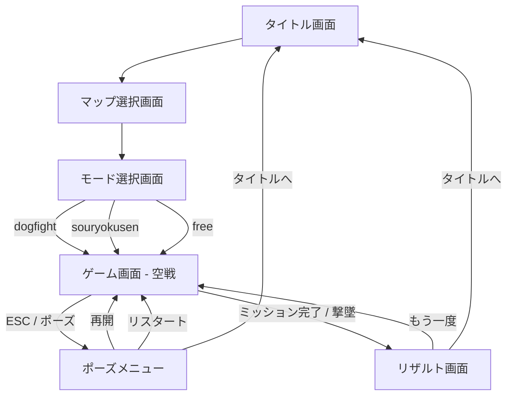

# 機能設計書

## 1. 画面一覧

| 画面 | 実装箇所 | 概要 |
|---|---|---|
| タイトル画面 | `#title-screen` | マップ選択・モード選択へのゲートウェイ |
| マップ選択画面 | `#map-screen` | オリジナル MAP / NEO 東京 を選択 |
| モード選択画面 | `#mode-screen` | dogfight / souryokusen / free を選択 |
| ゲーム画面 | Three.js canvas | 3D 空戦本体。HUD オーバーレイ付き |
| ポーズメニュー | `#pause-menu` | ゲーム中断・リスタート・タイトル戻り |
| リザルト画面 | `#result-screen` | ミッションクリア / ゲームオーバー表示 |

---

## 2. 画面遷移図



---

## 3. 操作体系

### PC 操作（キーボード＋マウス）

| 操作 | キー |
|---|---|
| ピッチ上下 | W / S |
| ロール左右 | A / D |
| 加速（ブースト） | Shift |
| 減速（ブレーキ） | Ctrl / Space |
| 機銃発射 | Z キー / 左クリック |
| ミサイル発射 | X キー / 右クリック |
| フレア展開 | C キー |
| ロックオン切替 | Tab |
| カメラ切替 | V |
| ポーズ | Esc |

### タッチ操作（スマホ・タブレット）

スマホは縦持ち起動後、`body { transform: rotate(90deg) }` で強制横画面化。

| 操作 | UI |
|---|---|
| ピッチ・ロール | 左サムスティック（仮想ジョイスティック） |
| ブースト | `BOOST` ボタン長押し |
| ブレーキ | `BRK` ボタン |
| 機銃 | `GUN` ボタン |
| ミサイル | `MSL` ボタン（残弾数表示付き） |
| フレア | `FLR` ボタン（残弾数表示付き） |
| ロックオン | `LCK` ボタン |

> タッチ座標変換（縦持ち時）：`viewport(px, py) → (clientY, W - clientX)` （W = window.innerWidth）

---

## 4. ゲームパラメータ

| パラメータ | 値 | 説明 |
|---|---|---|
| 初期速度 | 150 m/s | 巡航速度 (540 km/h) |
| 最大速度（ブースト） | 550 m/s | (1,980 km/h) |
| 最低速度（ブレーキ） | 50 m/s | 失速ライン |
| プレイヤー HP | 3 | 0 でゲームオーバー |
| ミサイル弾数 | 6 発 | ゲーム開始時に初期化 |
| フレア弾数 | 3 発 | ゲーム開始時に初期化 |
| ロックオン射程 | 3,000 m | この距離以内の敵をロック可能 |
| ミサイル誘導 | ホーミング | 旋回レート 3.5 rad/s |

---

## 5. HUD（ヘッドアップディスプレイ）

```
┌─────────────────────────────────────────┐
│ 速度: 150 m/s    SCORE: 0    HP: ●●●   │
│                                          │
│         (3D ゲームビュー)                │
│                 ＋                       │
│       [ロックオンレティクル]             │
│                                          │
│ [MSL ●●●●●●]           [FLR ●●●]      │
│ BOOST ██░░░░  [GUN] [LCK]              │
└─────────────────────────────────────────┘
```

---

## 6. 地上目標一覧（souryokusen モード）

| 種別 | HP | 特徴 |
|---|---|---|
| 戦艦 | 40 | 固定目標 |
| 戦車 | 20 | 固定目標 |
| 爆撃機 | 55 | 移動目標（vel あり） |
| SAM | 15 | 地対空ミサイルを発射 |
| キャリアボス | 専用 | 最後に出現するボス |

全 17 目標を破壊でミッションクリア。

---

## 7. マルチプレイ（実装中）

`src/multiplayer.ts` に `MultiplayerClient` クラスが存在し、`src/main.ts` からインポート済み。Cloudflare Workers + Durable Objects でのランダムマッチング実装を予定。現在は未接続スタブ。
