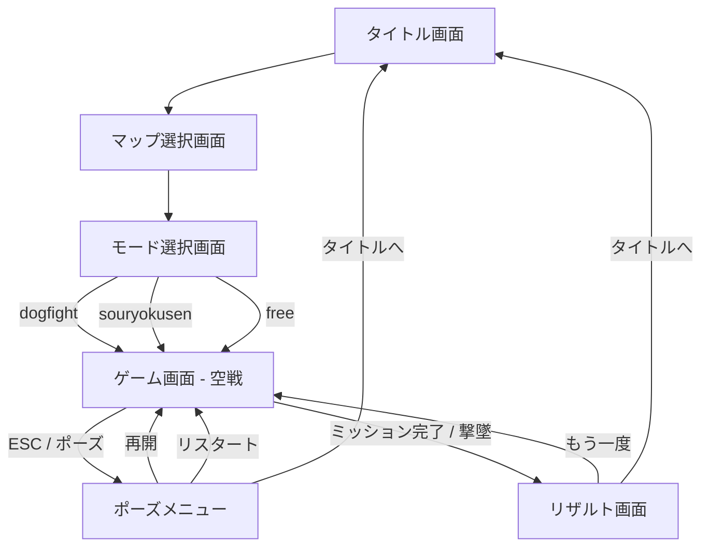

# 機能設計書

## 1. 画面一覧

| 画面 | 実装箇所 | 概要 |
|---|---|---|
| タイトル画面 | `#title-screen` | マップ選択・モード選択へのゲートウェイ |
| マップ選択画面 | `#map-screen` | オリジナル MAP / NEO 東京 を選択 |
| モード選択画面 | `#mode-screen` | dogfight / souryokusen / free を選択 |
| ゲーム画面 | Three.js canvas | 3D 空戦本体。HUD オーバーレイ付き |
| ポーズメニュー | `#pause-menu` | ゲーム中断・リスタート・タイトル戻り |
| リザルト画面 | `#result-screen` | ミッションクリア / ゲームオーバー表示 |

---

## 2. 画面遷移図



---

## 3. 操作体系

### PC 操作（キーボード＋マウス）

| 操作 | キー |
|---|---|
| ピッチ上下 | W / S |
| ロール左右 | A / D |
| 加速（ブースト） | Shift |
| 減速（ブレーキ） | Ctrl / Space |
| 機銃発射 | Z キー / 左クリック |
| ミサイル発射 | X キー / 右クリック |
| フレア展開 | C キー |
| ロックオン切替 | Tab |
| カメラ切替 | V |
| ポーズ | Esc |

### タッチ操作（スマホ・タブレット）

スマホは縦持ち起動後、`body { transform: rotate(90deg) }` で強制横画面化。

| 操作 | UI |
|---|---|
| ピッチ・ロール | 左サムスティック（仮想ジョイスティック） |
| ブースト | `BOOST` ボタン長押し |
| ブレーキ | `BRK` ボタン |
| 機銃 | `GUN` ボタン |
| ミサイル | `MSL` ボタン（残弾数表示付き） |
| フレア | `FLR` ボタン（残弾数表示付き） |
| ロックオン | `LCK` ボタン |

> タッチ座標変換（縦持ち時）：`viewport(px, py) → (clientY, W - clientX)` （W = window.innerWidth）

---

## 4. ゲームパラメータ

| パラメータ | 値 | 説明 |
|---|---|---|
| 初期速度 | 150 m/s | 巡航速度 (540 km/h) |
| 最大速度（ブースト） | 550 m/s | (1,980 km/h) |
| 最低速度（ブレーキ） | 50 m/s | 失速ライン |
| プレイヤー HP | 3 | 0 でゲームオーバー |
| ミサイル弾数 | 6 発 | ゲーム開始時に初期化 |
| フレア弾数 | 3 発 | ゲーム開始時に初期化 |
| ロックオン射程 | 3,000 m | この距離以内の敵をロック可能 |
| ミサイル誘導 | ホーミング | 旋回レート 3.5 rad/s |

---

## 5. HUD（ヘッドアップディスプレイ）

```
┌─────────────────────────────────────────┐
│ 速度: 150 m/s    SCORE: 0    HP: ●●●   │
│                                          │
│         (3D ゲームビュー)                │
│                 ＋                       │
│       [ロックオンレティクル]             │
│                                          │
│ [MSL ●●●●●●]           [FLR ●●●]      │
│ BOOST ██░░░░  [GUN] [LCK]              │
└─────────────────────────────────────────┘
```

### マップ境界

全マップ共通で飛行可能範囲を持つ。範囲端に近づくと `RETURN TO COMBAT AREA` を表示し、範囲外へ出た場合は座標を境界内へ戻して速度を落とす。

| マップ | 飛行可能範囲 |
|---|---|
| オリジナル MAP | x/z = -4300〜4300 |
| NEO 東京 MAP | x/z = -6800〜6800 |

---

## 6. 地上目標一覧（souryokusen モード）

| 種別 | HP | 特徴 |
|---|---|---|
| 戦艦 | 40 | 固定目標 |
| 戦車 | 20 | 固定目標 |
| 爆撃機 | 55 | 移動目標（vel あり） |
| SAM | 15 | 地対空ミサイルを発射 |
| キャリアボス | 専用 | 最後に出現するボス |

全 17 目標を破壊でミッションクリア。

---

## 7. NEO Tokyo 2077 — 世界観設定

### 概要
NEO TOKYOマップは2077年の東京を舞台にした高密度な垂直都市。実在する東京のランドマークを保存しながら、超高層タワー群、上層リング、空中高速道路、水上施設、巨大ドームを増築していった未来都市として描く。

### ランドマーク増築方針
| ランドマーク | 実在コア | NEO増築 | 飛行体験 |
|---|---|---|---|
| 東京タワー | 赤白トラス・展望台 | 外周展望リング・追加アンテナ | 塔の周囲を旋回して抜ける |
| スカイツリー | 細い芯塔・展望デッキ | 螺旋デッキ・上空ビーコン | 高高度の目印・ゲート |
| 東京駅 | 赤レンガ駅舎 | ガラスの空中ターミナル | 丸の内上空の低空ルート |
| レインボーブリッジ | 吊り橋・主塔 | 上層デッキ・発光レール | 橋上/橋下を抜ける湾岸ルート |
| フジテレビ | Hフレーム・球体 | 複数球体・発光リング | お台場の視認目標 |
| 浅草寺 | 門・五重塔・本堂 | 光の参道・浮遊灯籠 | 低層で静かな観光飛行ルート |

### 都市構造による飛行体験

NEO TOKYO では無理な地形高低差を作らず、東京の実地形に近い低い起伏と湾岸・河川の低地をベースにする。飛行体験は、ビル群の隙間、上層リング、空中ハイウェイ、巨大ドーム、ランドマーク増築をくぐる・沿う・回り込むことで作る。

半透明のアーチ、リング、水面、ホログラムは視覚演出であり、衝突対象にはしない。プレイヤーが「透けているのに通れない」と誤解しないよう、衝突するものは実体のあるビル・塔・ランドマークに限定する。

ビル窓は全面発光ではなく、暗い外壁に一部の窓、縦サイン、屋上発光が刺さる表現にする。近景には段付き・外骨格・尖塔型の主役タワーを配置し、遠景には衝突しないシルエットタワー群を置いて都市が続く圧を作る。

密度はビル数だけで増やさず、太い基壇、複合メガブロック、低中層ポディウムで都市床の厚みを作る。直方体の単体タワーだけでなく、円筒・多角柱・段付きボリューム・外骨格フィン・リングを組み合わせた近未来的な建築を混ぜる。

### 地区構成
- **ランドマーク保護ゾーン**: 東京記号を読ませるため、汎用巨大ビル・巨大支柱を置かない
- **コーポレートコア**: 細長い超高層タワー群、中央ドーム、上層リングで密度を作る
- **中層ハブエリア**: 空中高速道路、交通デッキ、商業ネオンで抜け道と速度感を作る
- **都市床/基壇エリア**: 低中層ポディウムと太い複合建築で、地表のスカスカ感をなくす
- **都市キャニオン**: 目に見えるレーンではなく、建物を置かない隙間で低空の抜け道を作る
- **外周メガストラクチャー**: 巨大支柱・リング・アーチ・スパイアを配置し、遠景とスケール感を作る
- **湾岸/河川ゾーン**: 地形を水面より下げ、ネオングリッドを水域に重ねない

### 配置ルール
- ランドマーク周辺には保護半径を設け、実在コアとNEO増築がビルで隠れないようにする
- 巨大ビルはランドマークの真横ではなく、外周・背景・都市の壁として配置する
- 地区ごとに建物の向きを揃え、無秩序な斜め配置を避ける
- 太いビル・基壇を増やす場合は、建物同士の最低間隔を取り、飛行できる谷間を残す
- 水面は `WATER_LEVEL` に統一し、水域の地形を沈めることで z-fighting を防ぐ
- 山手線・橋・高速道路・上層リングは「東京らしい導線」として、飛行中に追える太さと高さを優先する
- 道路・橋・空中回廊は急に終わらせず、環状線、都市軸、湾岸アプローチへ接続する
- レインボーブリッジは現実サイズよりも拡張し、主塔・上層デッキ・進入高架を含む湾岸の飛行ランドマークとして扱う
- 空中道路は太いチューブ状の構造物にし、外殻だけ衝突、内部は飛行可能にする
- チューブには周期的な入口スロットを設け、内部航路へ出入りできるようにする
- チューブ内では既存ビル衝突より航路を優先し、内部で詰まらないようにする

### 色彩パレット
- Corporate core: #3355FF / #B4CDFF (cold blue-white)
- Skyway: #3DDCFF (cyan)
- Signage: #FF2299 (magenta)
- Traffic: #FF6A22 (amber-orange)
- Water/ground: #07101A (dark wet steel)
- Industrial: #FF8800 (orange)
- Residential: #FFD055 (amber)

---

## 8. マルチプレイ（実装中）

`src/multiplayer.ts` に `MultiplayerClient` クラスが存在し、`src/main.ts` からインポート済み。Supabase Realtimeを使用した実装。現在は未接続スタブ。
