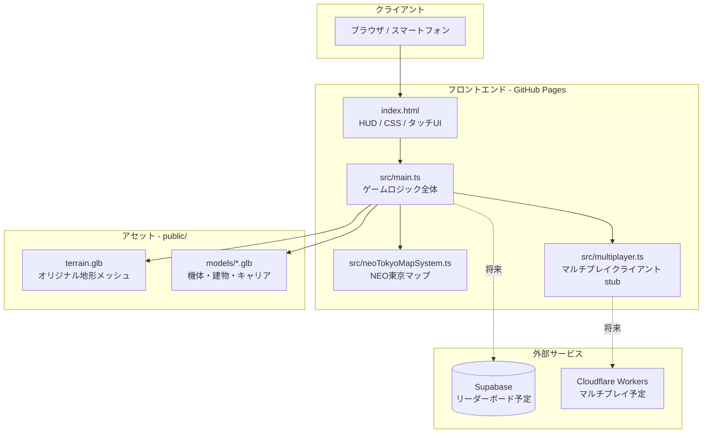
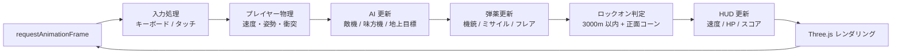
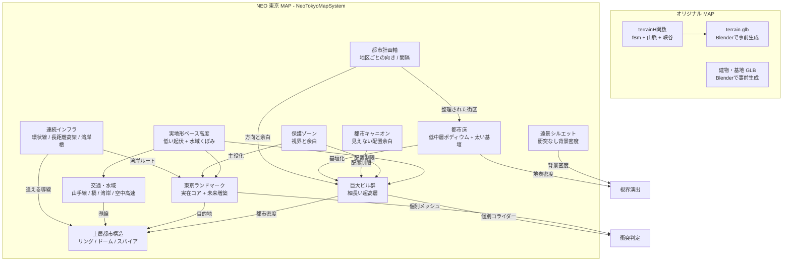
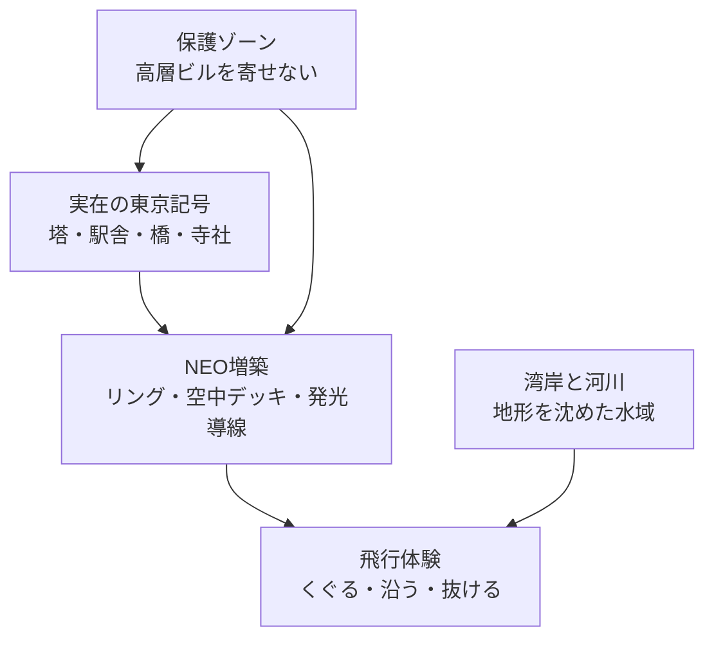
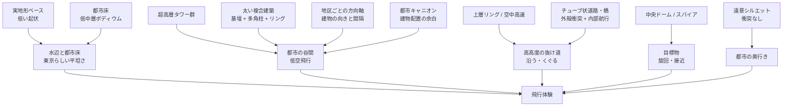
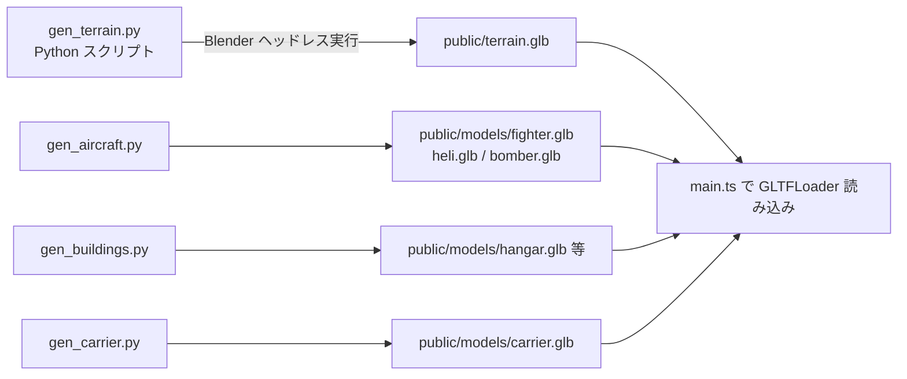

# アーキテクチャ設計書

## 1. システム構成概要

AirFighter は完全静的な SPA（Single Page Application）。サーバーサイドロジックは持たず、GitHub Pages からファイルを配信する。

---

## 2. テクノロジースタック

### レンダリング・ゲームエンジン

| 技術 | 用途 | 選定理由 |
|---|---|---|
| Three.js r184 | 3D レンダリング | WebGL 抽象化。ブラウザ完結で最も実績がある |
| TypeScript 6 | 言語 | 型安全。`any` 禁止で実行時エラーを事前排除 |
| Vite 8 | バンドラー / Dev サーバー | HMR が速く Three.js との相性が良い |

### レンダリング設定

| 項目 | 設定値 | 備考 |
|---|---|---|
| トーンマッピング | ACESFilmic | 映像的な露出感 |
| 露出 | 0.78 | 黄金時間帯の暖色 |
| ピクセル比 | PC: 2.0、モバイル: 1.5 | モバイルは描画負荷を下げる |
| シャドウ | PC のみ有効 | BasicShadowMap、512×512 |
| フォグ | FogExp2(0.000075) | 大気散乱の霞み |
| スカイ | Three.js Sky シェーダー | PC のみ（モバイルは背景色で代替） |

### インフラ

| 技術 | 用途 |
|---|---|
| GitHub Pages | 静的ホスティング（無料） |
| GitHub Actions | CI/CD（push to main → 自動ビルド & デプロイ） |
| Supabase | 将来のリーダーボード用 DB（環境変数 `VITE_SUPABASE_URL` / `VITE_SUPABASE_ANON_KEY`）|

---

## 3. ゲームループ構造

---

## 4. マップシステム

2 つのマップはロード時に切り替わる。切り替えは `cleanup()` → `initialize()` のライフサイクルで管理する。

### NEO 東京マップの衝突設計

`InstancedMesh` は `Box3.setFromObject()` を呼ぶと**全インスタンスを包含する巨大な箱**が返るため、プレイヤーが建物の隙間に入れなくなるバグが発生する。

解決策: 視覚用の InstancedMesh とは別に、建物ごとの不可視 Box コライダーを生成する。衝突対象は実体として扱うランドマークと建物コライダーに限定し、水面、ホログラム、発光リング、アーチのような半透明演出は装飾として扱う。

### NEO 東京マップのランドマーク設計

NEO 東京は「実在東京の骨格が2077年まで保存・増築された都市」として扱う。東京タワー、スカイツリー、東京駅、レインボーブリッジ、フジテレビ、浅草寺などは実在の形・色・位置をコアとして残し、その周囲に展望リング、空中デッキ、発光参道、上層橋などを増築する。

ランドマーク保護ゾーンでは汎用巨大ビルと巨大支柱を置かず、低層・広場・水辺・交通導線で視界を確保する。巨大ビルは外周や背景の都市壁として使い、東京らしい要素を主役として読めるようにする。

### NEO 東京マップの都市飛行設計

NEO 東京では地形をゲーム都合で大きく盛らない。`heightAt()` は武蔵野台地、都心低地、湾岸低地を低い起伏として近似し、飛行体験は低空ランドマーク、中空のゲート回廊、高空チューブの3層で作る。意味の薄い空中リング、細い高架線、巨大支柱は通常生成から外し、画面内の主役が散らからないようにする。

NEO 東京のマップ構成は PC とモバイルで変えない。端末差による最適化はピクセル比、アンチエイリアス、影などの描画設定に限定し、チューブ、ランドマーク、街区密度、飛行ルートは同じものを生成する。

`URBAN_CANYONS` は見えるガイドではなく、ビル配置を避けるための線分として使う。これにより、発光レーンを置かずに、ビル群の間へ自然な低空の抜け道を作る。遠景密度は `createDistantSkyline()` の装飾タワーが担当し、衝突対象には含めない。

地表の密度は `createUrbanFabric()` が担当する。低中層のポディウムと控えめな屋上設備を衝突なし装飾として敷き、地面が単なる平面に見えないようにする。ただし主役の飛行ルートを濁らせないため、床面の強い発光レールや意味の読みづらい四角いライン装飾は避ける。中空の読みやすい進行目標は `createFlightCanyonRoute()` の少数の矩形ゲートが担う。ルート周辺の空白感は `createRouteSideDensity()` が低中層の連続街区と太い近未来ブロックを左右に置いて補い、飛行導線のクリアランスを保ったまま都市の谷を作る。太い近未来建築は `createChunkyMegaBlocks()` が生成し、単体の直方体ではなく、箱・多角柱・リング・外骨格フィンを組み合わせた複合体として扱う。

都市の散らかりを抑えるため、`districtAngle()` で地区ごとの建物方向を揃え、`collectBuildingSpecs()` で建物フットプリント間の最低距離を確保する。高速道路と橋は短い孤立セグメントではなく、環状線、長距離高架、湾岸アプローチとして接続し、飛行中に追える都市の骨格として扱う。レインボーブリッジは現実位置を起点にしつつ、ゲーム内では主塔・広いデッキ・上層進入路を持つ大型ランドマークに拡張する。

主役となる空中道路だけをチューブ状に生成する。山手線ウェイポイントを使った環状チューブは `CatmullRomCurve3` と `TubeGeometry` で滑らかな高高度一周リングとして描画し、見た目のリングは途中で切らない。衝突は細かい `TubeCorridor` に分割して中心線からの距離で判定するが、内側にいる判定を優先し、線分境目の外殻候補で押し出されないようにする。壁際では外殻判定を有効に戻し、内壁・外壁から勝手に侵入/退出できないようにする。内側半径より内側は飛行可能、外殻厚みだけ接触対象にする。主要ノードには本線と同じ太さの分岐チューブを高速ICのように斜め接続し、`TubeOpening` は分岐口と合流口の小さなポータル判定に限定する。これにより外壁は基本的に閉じたまま、分岐チューブからだけ自然に合流できる。内部には中心ガイド、壁面ストリップ、ランプを置き、内壁の距離感が読める航路にする。チューブ周辺は `isInTubeReserve()` で広めの予約空間にし、ビル、リング、アーチ、一般高架が本線に重ならないようにする。上層リング、一般高架、橋の接続路は `buildOpenSkyway()` / `buildSkyRing()` の細い非衝突ガイドとして扱い、都市全体をチューブで埋めない。

### マップ境界設計

ゲームループ内でマップ別の矩形境界をチェックする。境界はオリジナル MAP と NEO 東京 MAP で別値を持つが、処理は共通で、プレイヤーが境界外へ出た場合は境界内へクランプし、速度を落として警告を表示する。

---

## 5. Blender GLB パイプライン（オリジナル MAP 用）

**重要**: `terrainH()` (main.ts) と `terrain_h()` (gen_terrain.py) は**完全一致が必要**。
地形関数を変更したら必ず GLB を再生成する。

---

## 6. モバイル最適化戦略

| 項目 | PC | モバイル |
|---|---|---|
| ピクセル比 | 2.0 | 1.5 |
| シャドウ | 有効 | 無効 |
| Sky シェーダー | 有効 | 無効（背景色） |
| ビル密度 | 100% | ~52%（seed > 0.52 でスキップ） |
| 山手線・高速道路 | 表示 | 非表示 |
| テレインセグメント数 | 128〜256 | 64 |
