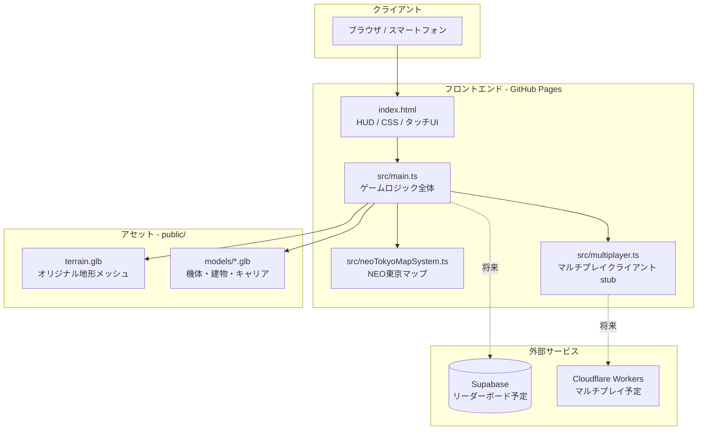
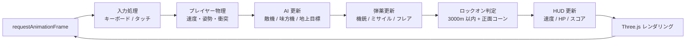
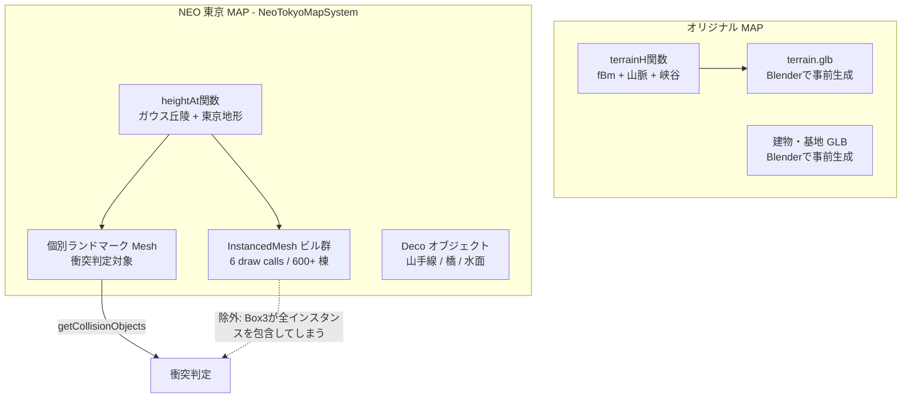
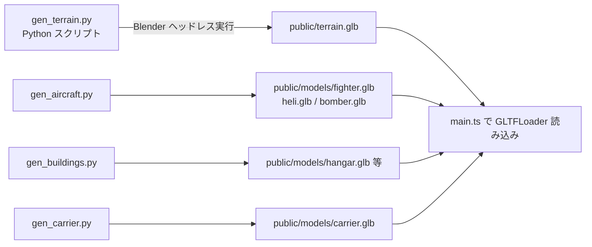

# アーキテクチャ設計書

## 1. システム構成概要

AirFighter は完全静的な SPA（Single Page Application）。サーバーサイドロジックは持たず、GitHub Pages からファイルを配信する。

---

## 2. テクノロジースタック

### レンダリング・ゲームエンジン

| 技術 | 用途 | 選定理由 |
|---|---|---|
| Three.js r184 | 3D レンダリング | WebGL 抽象化。ブラウザ完結で最も実績がある |
| TypeScript 6 | 言語 | 型安全。`any` 禁止で実行時エラーを事前排除 |
| Vite 8 | バンドラー / Dev サーバー | HMR が速く Three.js との相性が良い |

### レンダリング設定

| 項目 | 設定値 | 備考 |
|---|---|---|
| トーンマッピング | ACESFilmic | 映像的な露出感 |
| 露出 | 0.78 | 黄金時間帯の暖色 |
| ピクセル比 | PC: 2.0、モバイル: 1.5 | モバイルは描画負荷を下げる |
| シャドウ | PC のみ有効 | BasicShadowMap、512×512 |
| フォグ | FogExp2(0.000075) | 大気散乱の霞み |
| スカイ | Three.js Sky シェーダー | PC のみ（モバイルは背景色で代替） |

### インフラ

| 技術 | 用途 |
|---|---|
| GitHub Pages | 静的ホスティング（無料） |
| GitHub Actions | CI/CD（push to main → 自動ビルド & デプロイ） |
| Supabase | 将来のリーダーボード用 DB（環境変数 `VITE_SUPABASE_URL` / `VITE_SUPABASE_ANON_KEY`）|

---

## 3. ゲームループ構造

---

## 4. マップシステム

2 つのマップはロード時に切り替わる。切り替えは `cleanup()` → `initialize()` のライフサイクルで管理する。

### NEO 東京マップの衝突設計

`InstancedMesh` は `Box3.setFromObject()` を呼ぶと**全インスタンスを包含する巨大な箱**が返るため、プレイヤーが建物の隙間に入れなくなるバグが発生する。

解決策: `getCollisionObjects()` は個別配置した `landmarks` 配列のみを返す。InstancedMesh ビルは視覚専用。

---

## 5. Blender GLB パイプライン（オリジナル MAP 用）

**重要**: `terrainH()` (main.ts) と `terrain_h()` (gen_terrain.py) は**完全一致が必要**。
地形関数を変更したら必ず GLB を再生成する。

---

## 6. モバイル最適化戦略

| 項目 | PC | モバイル |
|---|---|---|
| ピクセル比 | 2.0 | 1.5 |
| シャドウ | 有効 | 無効 |
| Sky シェーダー | 有効 | 無効（背景色） |
| ビル密度 | 100% | ~52%（seed > 0.52 でスキップ） |
| 山手線・高速道路 | 表示 | 非表示 |
| テレインセグメント数 | 128〜256 | 64 |
